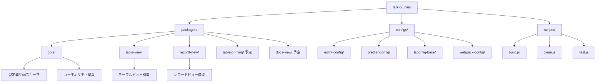

# Larkプラグインプロジェクト（モノレポ）

## 1. プロジェクト概要

このプロジェクトは、Larkプラットフォーム向けの各種カスタムプラグインを統合的に管理・開発するためのモノレポ構造を採用しています。Larkの基本機能を拡張し、業務効率化やユーザーエクスペリエンス向上を目的としています。

### 背景と目的

Larkは多機能なコラボレーションプラットフォームですが、特定の業務ニーズに対応するためにはカスタムプラグインが必要です。このプロジェクトでは、複数のプラグインを効率的に開発・保守するためのモノレポ構造を採用し、コード共有と一貫性の確保を実現しています。

### 現状

現在、テーブルビューとレコードビューの2つのプラグインが実装されており、今後テーブル印刷やドキュメントビューなどのプラグインを追加予定です。モノレポへの移行が完了し、開発環境が整備された状態です。

## 2. プロジェクト構造



### ディレクトリ構成

- `packages/`: 各プラグインとコアライブラリ
  - `core/`: 共通コアライブラリ（型定義、ユーティリティ関数）
  - `table-view/`: テーブルビュープラグイン
  - `record-view/`: レコードビュープラグイン
  - `table-printing/`: テーブル印刷プラグイン（予定）
  - `docs-view/`: ドキュメントビュープラグイン（予定）

- `configs/`: 共通設定ファイル
  - `eslint-config/`: ESLint設定
  - `prettier-config/`: Prettier設定
  - `tsconfig-base/`: 基本TypeScript設定
  - `webpack-config/`: 共通Webpack設定

- `scripts/`: 共通スクリプト
  - `build.js`: ビルドスクリプト
  - `clean.js`: クリーンスクリプト
  - `test.js`: テスト実行スクリプト

## 3. 技術スタック

### コア技術

- **言語**: TypeScript
- **ランタイム**: Node.js (>=18.0.0)
- **パッケージマネージャ**: pnpm
- **モノレポ管理**: pnpmワークスペース

### フロントエンド

- **UI ライブラリ**: React 18
- **UI コンポーネント**: Semi UI (@douyinfe/semi-ui)
- **状態管理**: React Hooks

### ビルド・開発ツール

- **トランスパイラ**: TypeScript, esbuild-loader
- **バンドラ**: Webpack 5
- **リンター**: ESLint
- **フォーマッター**: Prettier

### API・データ処理

- **API クライアント**: @lark-opdev/block-bitable-api
- **スキーマ検証**: Zod
- **ユーティリティ**: lodash-es

## 4. 主要コンポーネントとその機能

### コアライブラリ (@lark-plugins/core)

共通の型定義とユーティリティ関数を提供します。

- **型定義**: Zod スキーマによる堅牢な型システム
  - プラグイン設定
  - フィールド・ビュー・レコードの型定義
  - イベント型定義
- **ユーティリティ関数**:
  - フィールド操作関数
  - レコード操作関数
  - 文字列変換関数

### テーブルビュープラグイン (@lark-plugins/table-view)

Larkのテーブルデータをカスタムビューで表示します。

- テーブル選択・読み込み
- フィールド情報取得
- レコード一覧表示
- データの更新機能

### レコードビュープラグイン (@lark-plugins/record-view)

Larkの個別レコードをカスタムビューで表示します。

- レコード選択・読み込み
- フィールド情報取得
- レコード詳細表示
- レコード選択変更検知

## 5. 開発プロセス

### 環境セットアップ

```bash
# 依存パッケージのインストール
pnpm install

# 開発環境のビルド
pnpm run build
```

### 開発コマンド

- **ビルド**: `pnpm run build`
- **テスト**: `pnpm run test`
- **リント**: `pnpm run lint`
- **フォーマット**: `pnpm run format`
- **クリーンアップ**: `pnpm run clean`

### 個別パッケージの開発

```bash
# 例: テーブルビュープラグインの開発サーバー起動
cd packages/table-view
pnpm run dev
```

### デプロイ

```bash
# ビルド後、Larkプラットフォームにアップロード
cd packages/<plugin-name>
pnpm run upload
```

## 6. モノレポの利点と運用上の注意点

### 利点

- コード共有と再利用の促進
- 一貫した開発環境と設定
- 依存関係の統一管理
- パッケージ間の連携が容易

### 注意点

- pnpmのworkspace機能への理解が必要
- ビルドプロセスが複雑になる場合がある
- 変更が複数のパッケージに影響する可能性

## 7. トラブルシューティング

### よくある問題と解決策

- **ビルドエラー**: `pnpm run clean` で一度クリーンアップしてから再度ビルド
- **依存関係エラー**: `pnpm install` で依存関係を更新
- **Webpackの設定問題**: 各パッケージの `config/webpack.config.js` で個別に設定を上書き

## 8. 将来の展望

- テーブル印刷プラグインの実装
- ドキュメントビュープラグインの実装
- CI/CDパイプラインの構築
- テストカバレッジの向上

## 9. 参考資料・リンク

- [Lark 開発者ドキュメント](https://www.larksuite.com/en_us/developer/docs)
- [pnpm Workspaces](https://pnpm.io/workspaces)
- [TypeScript ドキュメント](https://www.typescriptlang.org/docs/)
- [Zod ドキュメント](https://zod.dev/)

---

このドキュメントは、プロジェクトの進行に伴い随時更新されます。質問や改善提案は、チームリーダーまでお寄せください。 