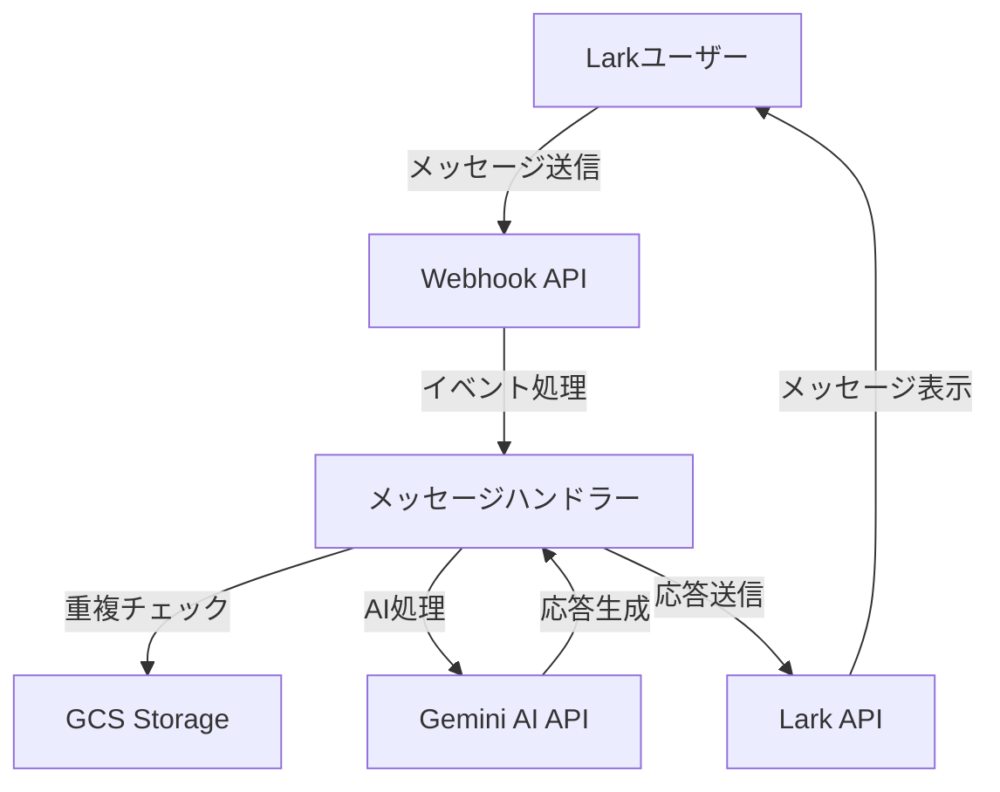
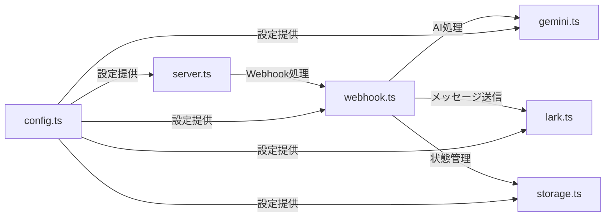

# Lark Custom Bot with Gemini AI

Lark（Feishu）メッセージングプラットフォーム上で動作する、Google Gemini AIを活用したカスタムボットアプリケーションです。

## 目次

- [プロジェクト概要](#プロジェクト概要)
- [アーキテクチャ](#アーキテクチャ)
- [セットアップ手順](#セットアップ手順)
- [開発ガイド](#開発ガイド)
- [デプロイメント](#デプロイメント)
- [トラブルシューティング](#トラブルシューティング)

## プロジェクト概要

### 目的
このプロジェクトは、Larkチャットプラットフォーム上でGoogle Gemini AIの機能を活用し、ユーザーからの質問に自動で応答するインテリジェントなチャットボットを提供します。

### 主要機能
- Larkメッセージの受信と処理
- Google Gemini AIによる自然言語処理
- メッセージの重複処理防止
- Google Cloud Storageを使用した状態管理

## アーキテクチャ

### システム構成図



### コンポーネント構成



## セットアップ手順

### 前提条件
- Node.js (v18.0.0以上)
- npm (最新版推奨)
- Google Cloud Platformアカウント
- Lark開発者アカウント

### 環境構築

1. リポジトリのクローン
```bash
git clone [repository-url]
cd lark-custom-bot
```

2. 依存パッケージのインストール
```bash
npm install
```

3. 環境変数の設定
\`.env\`ファイルを作成し、以下の変数を設定：
```bash
PORT=8080
GENAI_API_KEY=your_gemini_api_key_here
LARK_APP_ID=your_lark_app_id_here
LARK_APP_SECRET=your_lark_app_secret_here
GOOGLE_APPLICATION_CREDENTIALS=path/to/your/service-account-key.json
```

4. ビルドと実行
```bash
# 開発モード
npm run dev

# プロダクションビルド
npm run build
npm start
```

## 開発ガイド

### 技術スタック
- **言語**: TypeScript
- **ランタイム**: Node.js
- **フレームワーク**: Express.js
- **外部サービス**:
  - Google Gemini AI
  - Lark API
  - Google Cloud Storage

### プロジェクト構造
```
src/
├── server.ts      # アプリケーションのエントリーポイント
├── webhook.ts     # Webhookハンドラー
├── gemini.ts      # Gemini AI統合
├── lark.ts        # Lark API統合
├── storage.ts     # GCS状態管理
├── config.ts      # 設定管理
└── types.ts       # 型定義
```

### 開発フロー
1. 機能ブランチの作成
2. コードの実装
3. ユニットテストの作成と実行
4. コードレビュー
5. マージとデプロイ

## デプロイメント

### 本番環境へのデプロイ
1. 環境変数の設定
2. ビルド実行
3. サービスの起動

```bash
npm run build
npm start
```

### 監視とログ
- アプリケーションログは標準出力に出力
- Google Cloud Loggingで集中管理

## トラブルシューティング

### よくある問題と解決方法
1. Webhook接続エラー
   - Lark設定の確認
   - ネットワーク接続の確認

2. Gemini API エラー
   - APIキーの有効性確認
   - クォータ制限の確認

3. ストレージエラー
   - GCP認証情報の確認
   - バケットアクセス権限の確認

## ライセンス
MIT License

## コントリビューション
プロジェクトへの貢献を歓迎します。以下の手順で貢献できます：

1. Issueの作成
2. フォークとブランチの作成
3. 変更の実装
4. プルリクエストの作成

---

## 補足情報

### 関連リソース
- [Lark開発者ドキュメント](https://open.larksuite.com/document/)
- [Google Gemini AI ドキュメント](https://ai.google.dev/docs)
- [Google Cloud Storage ドキュメント](https://cloud.google.com/storage/docs)

### 連絡先
- テクニカルサポート: [担当者のメールアドレス]
- プロジェクト管理者: [管理者のメールアドレス]
